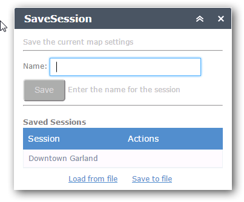
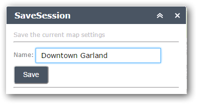
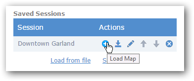
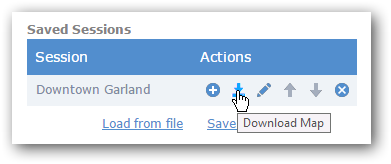
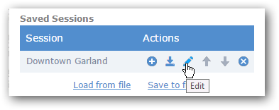
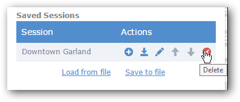
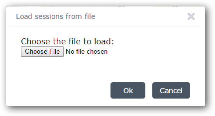
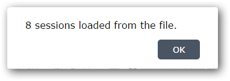
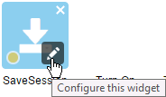
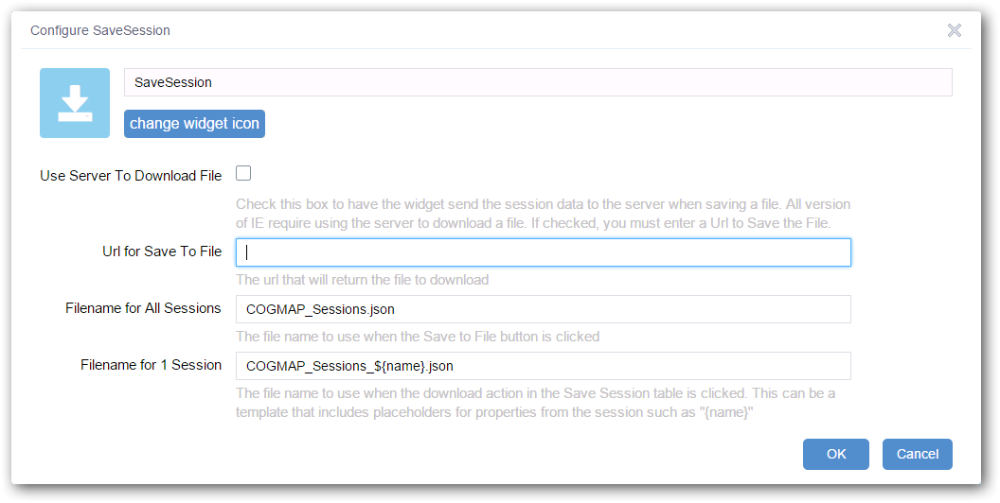

# SaveSession-Widget 1.2
The SaveSession Widget for ArcGIS Web AppBuilder enables users to save the current map settings into a session and restore them again later. A saved session includes the extent, visible layers and annotations of the current map. Sessions may be saved and loaded from files so they can be shared with others.

##Using the Widget
The SaveSession Widget is an in-panel widget that will be displayed in the toolbar of your WebApp Builder application. Click the  icon display the SaveSession panel. 

### Saving a Session
Once you have the map just the way you want it - zoomed to the area and layers turned on, enter a name for the session and click the Save button. The session will be added to the Saved Sessions list.

### Restoring a Session
To return the map to the same state as when you saved the session, you can double-click the title of the session to load the map.

### Managing Sessions in the List
Hover over the Actions column for a session entry to reveal the actions that can be performed on the entry. 

**Load Map** = will load the restore the selected session to the current map

**Download Map** = will save the session entry to a file that may be shared.

**Edit** = allows the user to change the session name

**Move Up - Down ** = lets you arrange the entries in the session list in the desired order

**Delete** = click the Delete button to remove the entry from the list

### Sharing Sessions
Saved Sessions may be shared with other users or another browser on the same PC by saving the session to a file and then loading the session from the file into the session list.

To save a single session to a file, click the Download Map action for the entry. To save all sessions in the list to a file, click the Save to file link.

To load the sessions from a file, click the Load from file link to display the Load sessions from file dialog

Click the Choose File button and select the file to load. The selected file must be a saved session file. All sessions from the file will be loaded. If a loaded session has the same name as an existing session, a number will be appended to the session to make the name unique.

## Adding the Widget to the Web AppBuilder
To add this widget to your ArcGIS WebApp Builder: 

* download the zip file of the widget
* unzip the contents into client\stemapp\widgets\SaveSession directory
* edit the \client\stemapp\config.json and enter the SaveSession widget in the widgets entry

Example:

	"widgets": [  
        {
            "uri": "widgets/SaveSession/Widget"
        }
    	...
    ]

## Configuring the Widget
Using the Web AppBuilder, click the edit icon on the SaveSession widget in the in-panel widgets to display the Configure Dialog.

**Use Server To Download File** = All browsers support downloading a file from a server. Some browsers like Chrome or Edge can support downloading a file of data without a round trip to the server by using a data url. Visit [http://caniuse.com/#feat=download](http://caniuse.com/#feat=download) to see if your browser supports downloading from data urls. To enable downloading from a data url, uncheck the box. To enable downloading from a server side service, check the box and enter a Url for Save to File. 

**Url for Save To File** = the Url that will return a file for the given data. The SaveSession widget will post the data to the url and the web service should respond with the file as an attachment.  This is only needed if Use Server To Download File is checked.

**Filename for All Sessions** = the file name to use when the Save to File link is clicked.

**Filename for 1 Session** = the file name to use when the Download action is used to save a single session to a file. Include the "{name}" placeholder that will be replaced with the session name at runtime.   

##FAQ
###The Save to File link does not work?
Visit [http://caniuse.com/#feat=download](http://caniuse.com/#feat=download) to see if your browser supports downloading from data urls. If not, then you'll need to enable the Use Server To Download File option and create a service that returns the session file as an attachment.

 *Note that a web service that downloads the session file is not included in the widget. It lives outside the widget on your own web server.*

##Sponsors
**Thanks to the City of Garland, Texas for sponsoring the initial development of the SaveSession Widget and releasing it to the community.**
 